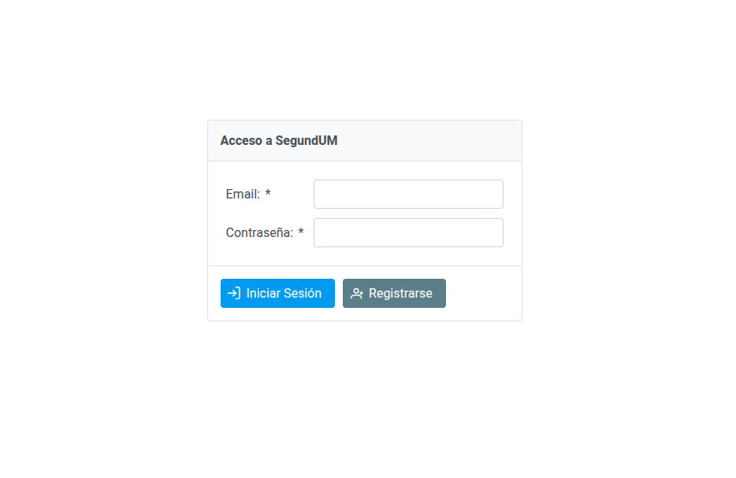
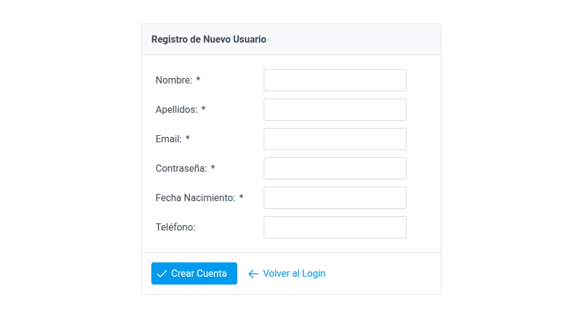
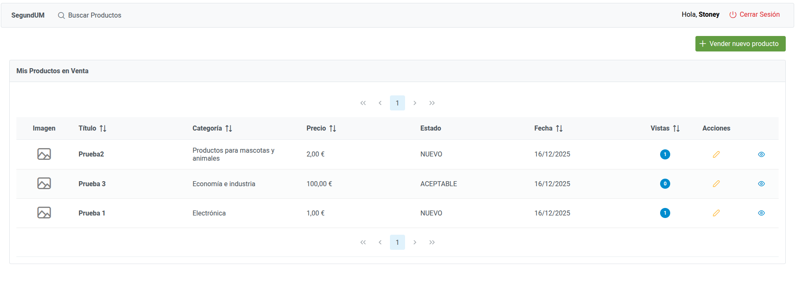
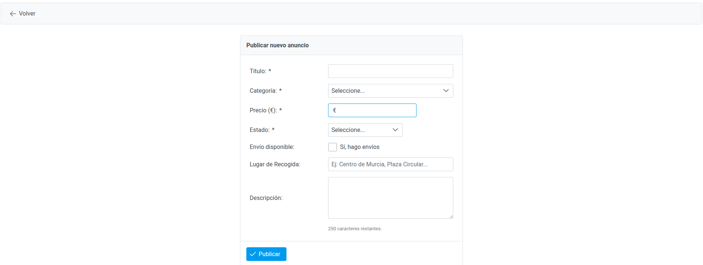
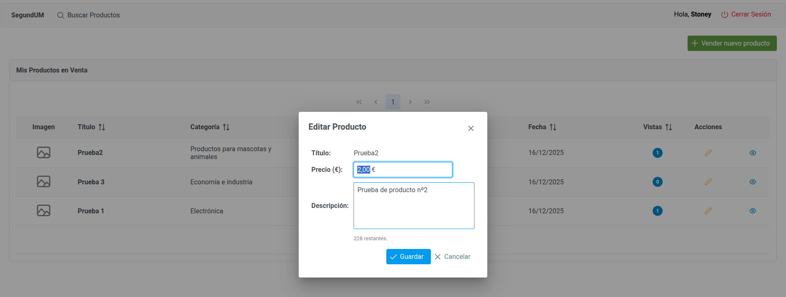
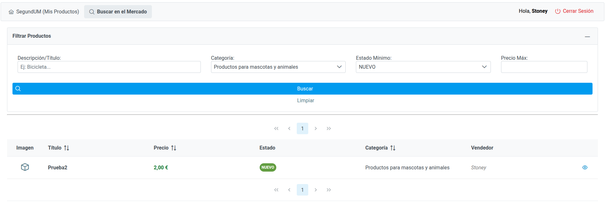
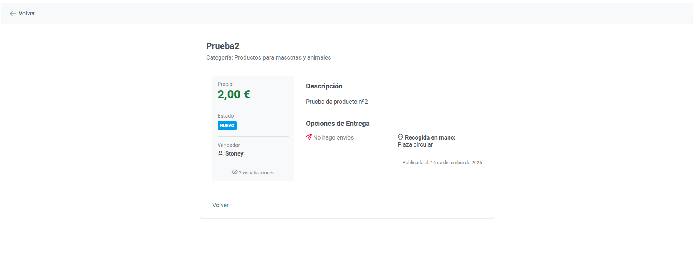

# aadd2025
Repositorio con la [entrega del proyecto de aplicaciones distribuidas 2025/2026](SegundUM)

### 👥 Miembros
  - [Alberto Zapata Mira (StoneySpring688)](https://github.com/StoneySpring688)
---

# Manual de Usuario - SegundUM

Este documento describe brevemente el funcionamiento de la plataforma **SegundUM**, diseñada para la compra y venta de productos de segunda mano.

## 1. Acceso y Registro

Al acceder a la aplicación, se presenta la pantalla de inicio de sesión.

* **Iniciar Sesión:** Introduzca su correo electrónico y contraseña registrados. Pulse **"Iniciar Sesión"** para acceder a su área privada.

  
  
* **Registrarse:** Si es un nuevo usuario, pulse el botón **"Registrarse"** para crear una cuenta proporcionando sus datos personales (Nombre, Apellidos, Email, Fecha de nacimiento, etc.).

  

## 2. Panel Principal: Mis Productos

Tras identificarse, accederá a la vista principal **"SegundUM"**. Aquí podrá gestionar su inventario personal.



* **Listado:** Se muestran todos los productos que tiene actualmente a la venta, indicando su categoría, precio, estado y número de visualizaciones.
* **Acciones:** En la columna derecha de la tabla encontrará botones para interactuar con cada producto (Editar o Ver Detalle).

## 3. Publicar un Nuevo Anuncio

Para poner un artículo a la venta, pulse el botón verde **"Vender nuevo producto"** situado sobre el listado principal.



Deberá completar el formulario con los siguientes datos:

* **Título y Descripción:** Información detallada del artículo.
* **Categoría y Estado:** Seleccione las opciones que mejor describan el producto.
* **Precio:** Indique el importe en Euros.
* **Logística:** Marque si realiza envíos o especifique un **Lugar de Recogida** (ej: "Plaza Circular, Murcia").

Pulse **"Publicar"** para guardar el anuncio. Aparecerá inmediatamente en su listado.

## 4. Editar Producto

Si necesita modificar el precio o la descripción de un producto ya publicado:

1. Localice el producto en su listado principal.
2. Pulse el botón naranja con el icono del **lápiz**.
3. Se abrirá una ventana emergente donde podrá actualizar los datos.
   
   
4. Pulse **"Guardar"** para confirmar los cambios sin salir de la página.

## 5. Buscador de Productos

Para explorar el mercado global, pulse la opción **"Buscar Productos"** en la barra de menú superior.



* **Filtros:** Puede refinar su búsqueda por texto, categoría específica, estado de conservación mínimo y precio máximo.
* **Resultados:** Pulse el botón **"Buscar"** para visualizar los artículos de otros vendedores que coincidan con sus criterios.

**nota** : en la busqueda de productoes se podrá apreciar que el filtro por estado del producto es un threshold, lo que quiere decir que si buscas por COMO_NUEVO, mostrará también los que están marcados con NUEVO, esto se debe a que un usuario que busque productos por un determinado estado, también puede estar interesado en productos en mejor estado.

Esto puede alterarse refactorizando el método `esMejorOIgualQue()` de la entidad del dominio *EstadoProducto*
```java 
public boolean esMejorOIgualQue(EstadoProducto otro) {
        return this.nivel >= otro.nivel;
    }
```
Para que la condición sea `nivel == otro.nivel`.

## 6. Ficha de Detalle

Para consultar toda la información de un producto (ya sea propio o de una búsqueda):

1. Pulse el botón azul con el icono del **ojo** en el listado.
2. Accederá a la **Ficha del Producto**, donde verá los detalles completos, el nombre del vendedor y las opciones de entrega (Envío o Recogida).
   
   
3. Esta acción incrementa el contador de visualizaciones del producto.
